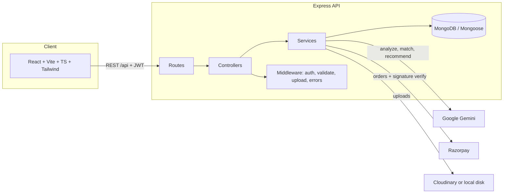

# WorkWave Architecture

## High-level



## Layers

**Frontend** — React SPA. `services/api.ts` is a single Axios instance that attaches the JWT and normalizes errors. `AuthContext` holds the session. `RequireAuth` guards role-scoped route trees. Pages are grouped by role; shared pages (Projects, Messages, Profile, Payments) adapt to `user.role`.

**Routes** — declare URL, middleware chain, and validation rules. No business logic here.

**Controllers** — parse input, call services/models, shape the `{success, message, data}` envelope. Ownership checks live here (e.g. `Job.findOne({_id, clientId})`).

**Services** — external integrations and cross-entity rules:
- `aiService` — Gemini prompts + response validation + deterministic fallback. Every result carries a `provider` field.
- `paymentService` — Razorpay order creation + HMAC-SHA256 signature verification (`timingSafeEqual`).
- `storageService` — Cloudinary when configured, else local disk under `backend/uploads`.
- `messagingService` — encodes the rule "messaging allowed after shortlist/hire".
- `notificationService` — fire-and-forget notifications that never break the main flow.
- `resumeService` — PDF/DOCX text extraction (pdf-parse / mammoth).

**Models** — Mongoose schemas with validation, enums, indexes, timestamps.

## Data model & relationships

```
User 1───n Job          (clientId)
User 1───n Proposal     (freelancerId)     Job 1───n Proposal
Proposal 1──1 Project   (accepted proposal creates project)
Project 1──n Milestone  (embedded subdocs — always queried via project)
Project 1──n Payment    (optionally milestoneId)
Project 1──2 Review     (one per direction, only when COMPLETED)
User 1───1 Resume       (extractedText select:false — privacy)
User 1───n AIAnalysis   (typed audit trail of every AI call)
User 1───n Notification, Bookmark, PortfolioItem, Report
Conversation 1──n Message   (participants: [clientId, freelancerId])
Category (admin-managed)
```

## Indexing decisions

| Collection | Index | Why |
|---|---|---|
| users | `email` unique, `role`, `skills`, text(name/headline/bio) | login lookup, role filtering, freelancer search |
| jobs | `clientId`, `status`, `category`, `requiredSkills`, `status+createdAt`, text index | "my jobs", public feed sorted by recency, filters, search |
| proposals | `jobId`, `freelancerId`, `status`, **partial unique** `(jobId,freelancerId)` on active statuses | per-job lists, "my proposals", duplicate active proposal prevention |
| projects | `clientId`, `freelancerId`, `status` | per-role dashboards |
| messages | `conversationId+createdAt` | thread pagination |
| reviews | `reviewedUserId`, unique `(projectId,reviewerId)` | profile rating, one review per direction |
| payments | `projectId`, `razorpayOrderId`, `status` | project history, verification lookup |
| notifications | `userId+isRead+createdAt` | unread badge + list |

## Key flows

**Hiring (transactional):** `POST /proposals/:id/accept` runs inside a Mongoose session transaction: proposal → ACCEPTED, all other active proposals → REJECTED, job → IN_PROGRESS, Project created. A failure anywhere rolls everything back.

**Payment verification:** frontend never marks a payment successful. Razorpay checkout returns `order_id`, `payment_id`, `signature`; the backend recomputes `HMAC_SHA256(order_id|payment_id, secret)` and compares with `crypto.timingSafeEqual`. Mismatch → `VERIFICATION_FAILED` record, 400 response.

**Messaging gate:** `messagingService.canCommunicate` allows a conversation only when a SHORTLISTED/ACCEPTED proposal or a non-cancelled project exists between the pair.

**Resume privacy:** `extractedText` is `select:false` — only fetched explicitly for the owner's AI analysis. Resume files require the owner role; the file reference is never sent to other users.

## AI design

`AIService` exposes `analyzeResume`, `analyzeJobDescription`, `matchProfileToJob`, `generateJobRecommendations`, `generateProposalDraft`. With `GEMINI_API_KEY`, prompts request strict JSON (`responseMimeType: application/json`), the output is parsed via `extractJson` and shape-validated before use. Without a key — or on any Gemini failure — a deterministic heuristic analyzer runs (skill-dictionary extraction, section detection, overlap scoring) and results are labeled `provider: 'fallback'`. All analyses persist to `AIAnalysis` for auditability.

**Data minimization:** only resume text / skills / headline / years of experience and the job description are sent to Gemini — never emails, passwords, tokens, or payment data.

## Security checklist

- bcrypt(10) password hashing; `passwordHash` is `select:false` and stripped by `toSafeObject()`
- JWT auth middleware + `restrictTo(role)` authorization + per-resource ownership checks
- express-validator input validation; consistent 400 envelope
- helmet, CORS allowlist (`CLIENT_URL`), global + auth rate limits
- multer memory storage with MIME whitelist + size caps; Cloudinary or sandboxed local dir
- Mongo safety: Mongoose parameterized queries, `escapeRegex` on user search input
- payment signature verification server-side; signature stored `select:false`
- no secrets in repo; `.env.example` documents every variable
- suspended accounts are blocked at both login and JWT verification

## Scaling path

- Stateless API + JWT → horizontal scaling behind a load balancer
- Move messaging to Socket.IO + Redis adapter for realtime
- Queue AI calls (BullMQ/SQS) for latency isolation and retry policy
- Cloudinary CDN already offloads media; add response caching for public job lists
- Read replicas for heavy read traffic; keep transactions on primary
